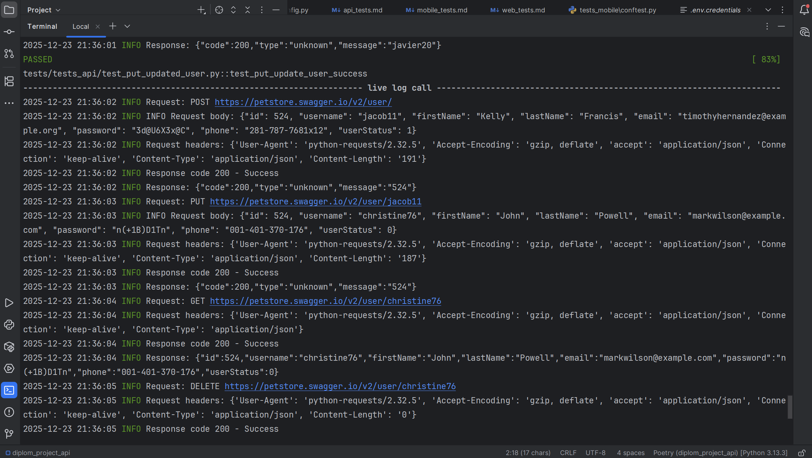
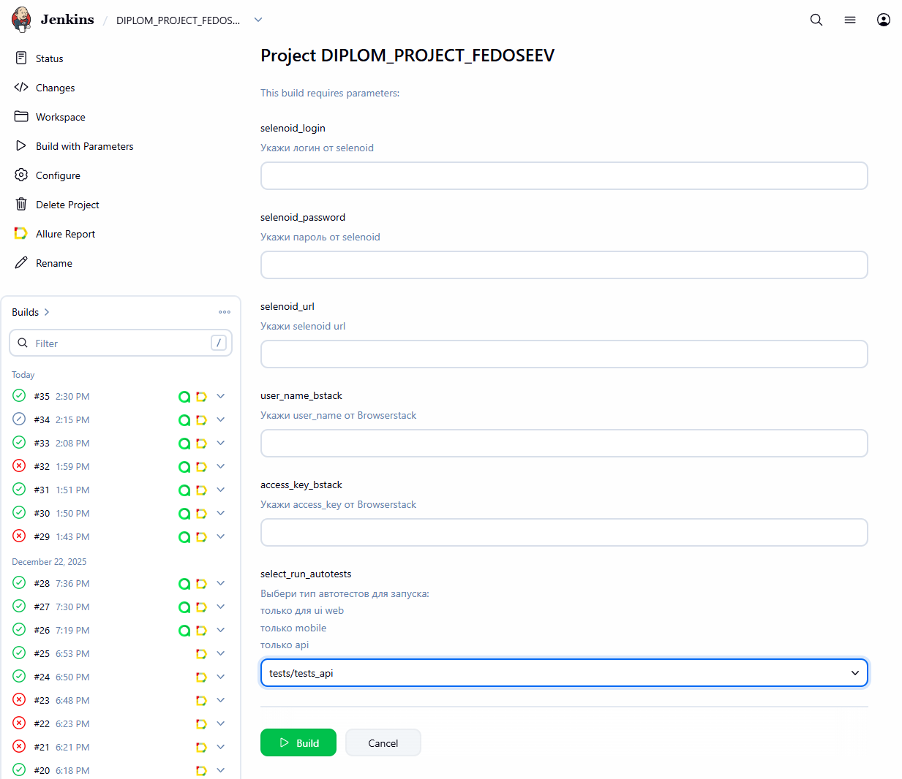
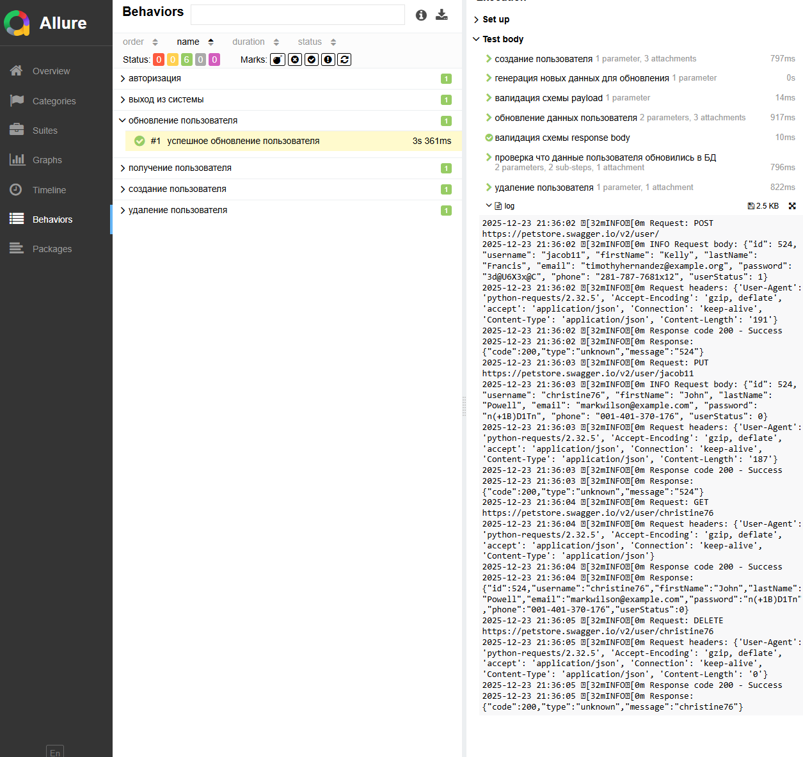
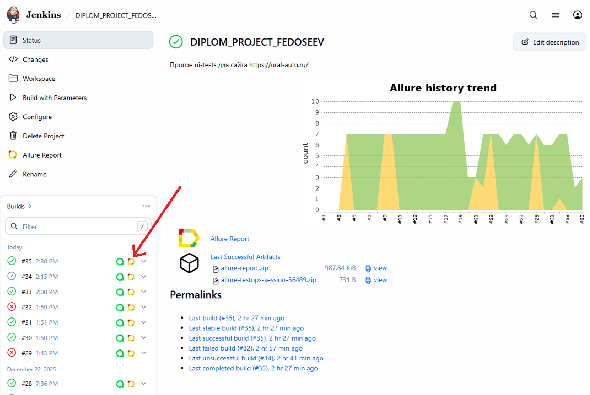
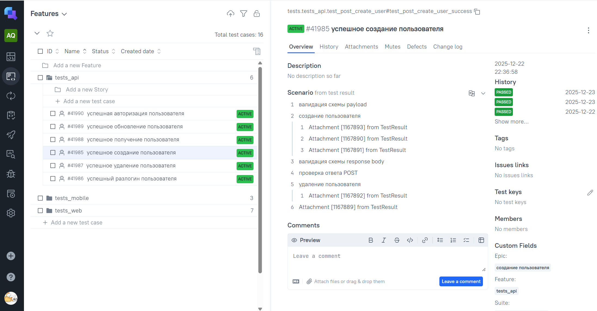

# Пример проекта API автотестов

###  Используемые технологии

<p align="center">
  <code></code
  <code></code>
  <code></code>
  <code></code>
  <code></code>
  <code></code>
  <code></code>
  <code></code>
  <code></code>


## Покрываемый функционал

* ✅ login пользователя
* ✅ logout пользователя
* ✅ Создание пользователя
* ✅ Получение пользователя
* ✅ Обновление пользователя
* ✅ Удалние пользователя

## Запуск тестов
#### Все API тесты запускаются удалённо (Jenkins), но их можно запустить и локально

### Локально

Для локального запуска тестов нужно выполнить следующие шаги:
1. Склонировать репозиторий
2. Открыть проект в PyCharm
3. Ввести в терминале следующие команды
   
   3.1 установка зависимостей
   ```bash
   poetry install
   ```
   3.2 запуск тестов 
   ```bash
   pytest tests/tests_api
   ```
#### Для тестов на API поключены логи 


   
### Запкск с помощью [Jenkins](https://jenkins.autotests.cloud/job/DIPLOM_PROJECT_FEDOSEEV/)
#### Для запуска автотестов необходимо:
 - Открыть [джобу](https://jenkins.autotests.cloud/job/DIPLOM_PROJECT_FEDOSEEV/) в jenkins
 - Нажать на кнопку Build with Parameters
 - В select_run_autotests выбрать tests/tests_api
 - Нажать на Build



## Отчет о прохождении тестов (Allure)
### Локально
Для получения отчета нужно ввести команду 
```
allure serve allure-results
``` 
Ниже представлен пример allure отчета 


Подробные инструкции по работе с allure можно найти по [ссылке](https://allurereport.org/docs/).
### Если тесты запускались в Jenkins

Для получения отчета нужно нажать на иконку allure report'a в строке билда  
У него будет точно такой же формат, как и при получении локально


### В проекте реализована интеграция с [Allure TestsOps](https://allure.autotests.cloud/project/5062/dashboards)



### В проекте настроена отправка allerts в Telegram

