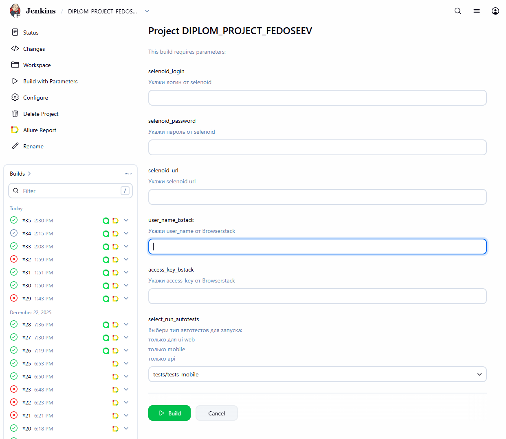
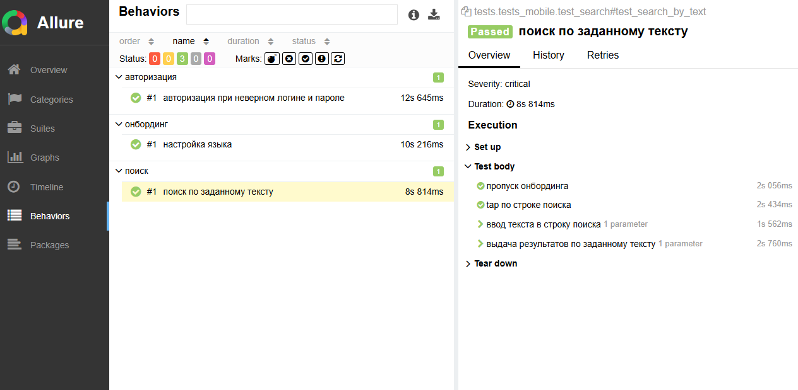
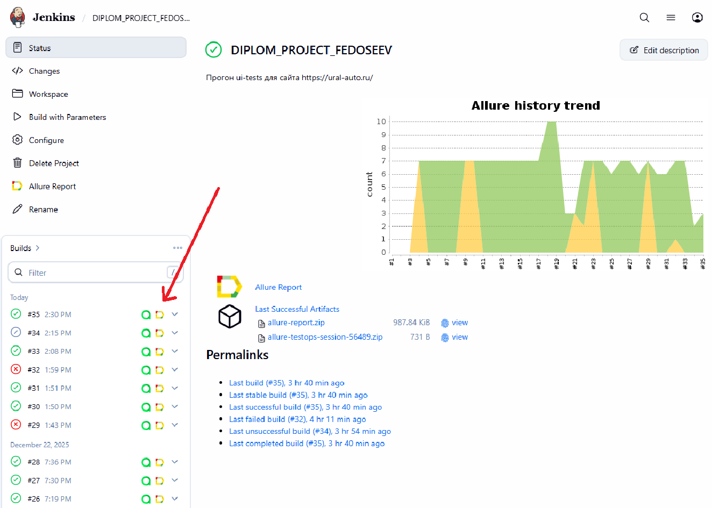
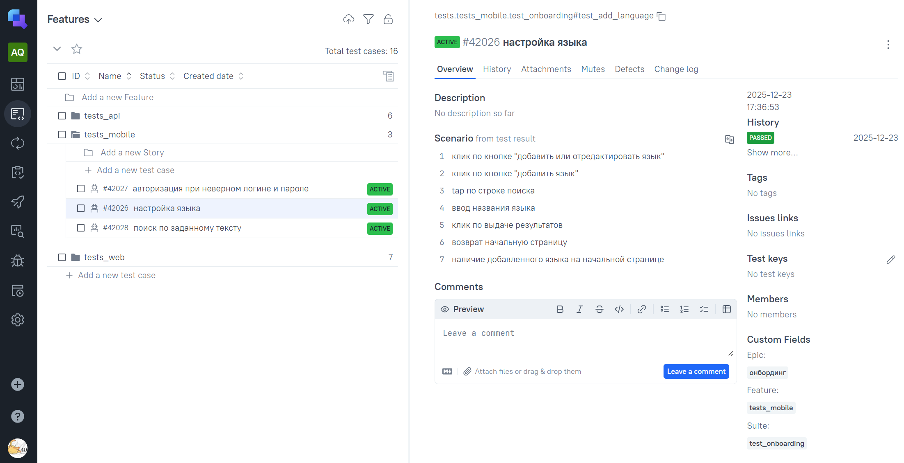

# Пример проекта мобильных автотестов для приложения WIKIPEDIA

###  Используемые технологии
<p align="center">
  <code></code
  <code></code>
  <code></code>
  <code></code>
  <code></code>
  <code></code>
  <code></code>
  <code></code>
  <code></code>
  <code></code>

## Покрываемый функционал
  
* ✅ Валидация полей логина и пароля
* ✅ Поиск статьи по названию
* ✅ Добалвение настроек языка

## Запуск тестов
#### Mobile тесты можно запустить локально на эмуляторе или на [BrowserStack](https://www.browserstack.com)

### Локально на эмуляторе
#### Настройка
1. Установить Node.js и npm
2. Установить Appium
3. Установить драйвера UiAutomator2 для Appium
4. Установить Android Studio
5. Настроить Android Studio и установка SDK
6. Создать виртуальное устройство в Android Studio. В проекте используется Google Pixel 9
8. Установка Java Development Kit (JDK)
9. Установка Appium Inspector

#### Запуск тестов

1. Склонировать репозиторий
2. Открыть проект в PyCharm
3. Запустить сервер Appium
    ```bash
   appium
   ```
4. Запустить Android Studio и настроить сессию с эмулятором Google Pixel 9
5. Ввести в терминале следующие команды
   
   5.1 установка зависимостей
   ```bash
   poetry install
   ```
      5.2 запуск тестов 
   ```bash
   pytest tests/tests_mobile --mobile-context=local_emulator
   ```

### Удаленно через [BrowserStack](https://app-automate.browserstack.com/)

Важно! Перед запуском, в корне проекта, нужно создать файл .env.сredentials и указать там 
* USER_NAME_BSTACK
* ACCESS_KEY_BSTACK

#### Запуск тестов

1. Склонировать репозиторий
2. Открыть проект в PyCharm
3. Ввести в терминале следующие команды
   
   3.1 установка зависимостей
   ```bash
   poetry install
   ```
      5.2 запуск тестов 
   ```bash
   pytest tests/tests_mobile --mobile-context=bstack 
   ```
   
### С помощью [Jenkins](https://jenkins.autotests.cloud/job/DIPLOM_PROJECT_FEDOSEEV/)
#### Для запуска автотестов необходимо:
 - Открыть [джобу](https://jenkins.autotests.cloud/job/DIPLOM_PROJECT_FEDOSEEV/) в jenkins
 - Нажать на кнопку Build with Parameters
 - указать credentials в параметрах user_name_bstack, access_key_bstack
 - В select_run_autotests выбрать tests/tests_mobile
 - Нажать на Build

 


## Отчет о прохождении тестов (Allure)
### Локально
Для получения отчета нужно ввести команду 
```
allure serve allure-results
 ```
Ниже представлен пример allure отчета 


Подробные инструкции по работе с allure можно найти по [ссылке](https://allurereport.org/docs/).

### Если тесты запускались в Jenkins

Для получения отчета нужно нажать на иконку allure report в строке билда. 
У него будет точно такой же формат, как и при получении локально.



### В проекте реализована интеграция с [Allure TestsOps](https://allure.autotests.cloud/project/5062/dashboards)


### В проекте настроена отправка allerts в Telegram


